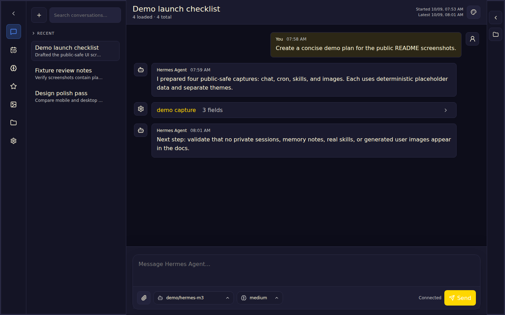
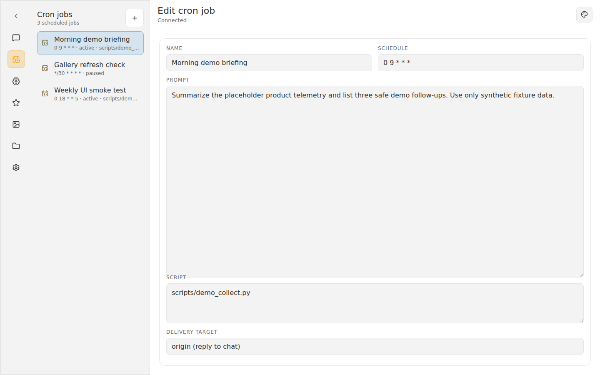
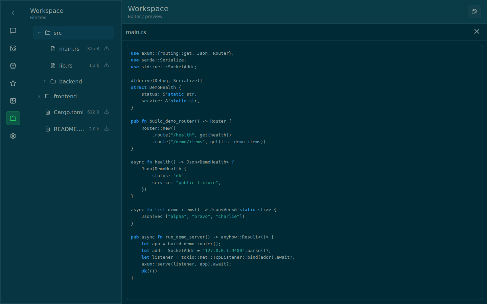
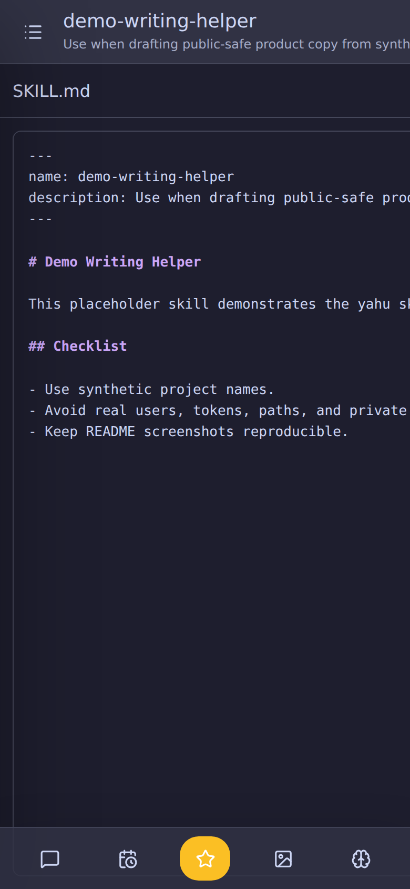
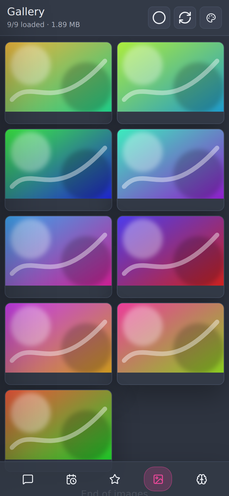

# yahu — Yet Another Hermes UI

A lightweight web interface for [Hermes Agent](https://github.com/NousResearch/hermes-agent), packaged as one Rust binary with an embedded React frontend.

Yahu is designed to sit beside an existing Hermes Agent installation. Point it at the Hermes API Server, choose the Hermes home/workspace/image directories you want it to expose, and open it in a browser. It does not install Hermes plugins, migrate Hermes data, or patch the running agent.

## Project highlights

- **Single binary:** the built `yahu` executable serves the backend API, static frontend assets, and image/workspace helpers.
- **Non-intrusive:** runs alongside Hermes Agent through the API Server; no changes to the Hermes Agent repo or profile are required.
- **Batteries included UI:** chat, session history, cron, memory, skills, workspace files, and image gallery in one interface.
- **Mobile-aware:** chat, skills, cron, and image browser layouts work on narrow screens with touch-friendly controls.
- **Themeable and multilingual:** 10 built-in themes plus English, 简体中文, 繁體中文, and 日本語.
- **Release artifacts:** every pushed tag builds release binaries; download prebuilt artifacts from [GitHub Releases](https://github.com/fffonion/yahu/releases).

## Features

### Chat and sessions

- Browse and search Hermes sessions without loading every title in the browser.
- Stream replies through the Hermes API Server.
- Pick the active model and reasoning effort from the composer.
- Rename or delete sessions from the session list context menu.
- Watch sessions updated from other Hermes platforms in near real time.

### Cron jobs

- List, create, edit, run, pause/resume, and delete Hermes cron jobs.
- Split layout with job list on the left and a large prompt/script editor on the right.
- Icon-first job actions for compact desktop and mobile use.

### Memory and skills

- Edit Hermes user/profile memory from the browser.
- Browse installed skills, open skill files, and toggle skill enablement.
- Skills page includes a file tree for skill references/templates/scripts.

### Workspace and image browser

- Browse a configured workspace root with syntax-highlighted previews.
- Rename/delete workspace files through context menus.
- View Hermes image cache with lazy loading, metadata, selection mode, and touch gestures.
- Download original images or generated HEIC variants; selected downloads use browser multi-file downloads.
- Image refresh follows filesystem watcher updates from the configured image directory.

## Screenshots

### Chat



### Cron



### Workspace



### Skills and Image browser

<p>
  
  
</p>

## Install from a release

Prebuilt artifacts are attached to each tagged [GitHub Release](https://github.com/fffonion/yahu/releases):

- `yahu-x86_64-unknown-linux-gnu.tar.gz`
- `yahu-aarch64-unknown-linux-gnu.tar.gz`
- `yahu-aarch64-apple-darwin.tar.gz`
- `yahu-x86_64-pc-windows-gnu.zip`

Example for Linux x86_64:

```bash
curl -LO https://github.com/fffonion/yahu/releases/latest/download/yahu-x86_64-unknown-linux-gnu.tar.gz
tar -xzf yahu-x86_64-unknown-linux-gnu.tar.gz
install -m 0755 yahu ~/.local/bin/yahu
```

## Run

Start Hermes Agent's API Server first, then run yahu against it:

```bash
# Local, no yahu login gate:
yahu --insecure --api-url http://127.0.0.1:8642 --host 127.0.0.1 --port 9642

# With yahu auth enabled:
HERMES_WEBUI_AUTH_KEY='your-password' \
HERMES_API_KEY='your-hermes-api-key' \
yahu --api-url http://127.0.0.1:8642 --host 0.0.0.0 --port 9642
```

Open `http://127.0.0.1:9642`.

## Configuration

| Flag | Env | Default | Description |
|------|-----|---------|-------------|
| `--host` | `HERMES_WEBUI_HOST` | `127.0.0.1` | Listen address |
| `--port` | `HERMES_WEBUI_PORT` | `9642` | Listen port |
| `--api-url` | `HERMES_WEBUI_API_URL` | `http://127.0.0.1:8642` | Hermes API Server upstream |
| `--hermes-home` | `HERMES_HOME` | `$HOME/.hermes` | Hermes data directory |
| `--workspace` | `HERMES_WEBUI_WORKSPACE` | `$HOME/workspace` | File browser root |
| `--image-dir` | `HERMES_WEBUI_IMAGE_DIR` | `$HERMES_HOME/cache/images` | Image gallery directory |
| `--insecure` | | | Skip yahu login gate |

## Service install

```bash
make install          # install ~/.local/bin/yahu
make service-install  # install ~/.config/systemd/user/yahu.service
make service-enable   # enable and start the user service
```

System-level templates are in `deploy/` for hosts that prefer `/etc/systemd/system/yahu.service`.

## Build from source

Requirements: Rust stable and Bun.

```bash
bun install
bun run build
cargo build --release
```

The frontend is embedded into the Rust binary at compile time. After frontend changes, rebuild both the frontend assets and the release binary.

## Source layout

- `frontend/` — React/Vite UI, CSS, TypeScript helpers, and Bun tests.
- `src/main.rs` — binary entrypoint.
- `src/backend/` — Axum backend modules for auth, proxying, sessions, workspace, skills, memory, and images.
- `src/lib.rs` — Rust helpers shared by the binary and integration tests.
- `deploy/` — user and system service templates.
- `scripts/` — supporting scripts included in release archives.

## CI and releases

- Pull requests and pushes to `main`/`master` run frontend build/tests and Rust tests.
- Every pushed tag builds release artifacts for Linux x86_64, Linux ARM64, macOS ARM64, and Windows x86_64.
- Release artifacts are attached to the generated GitHub Release for that tag.

## License

MIT
