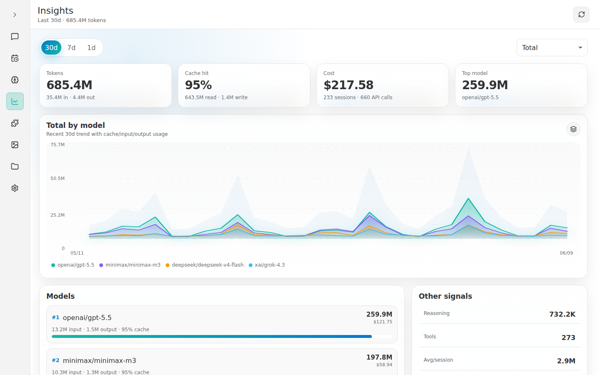
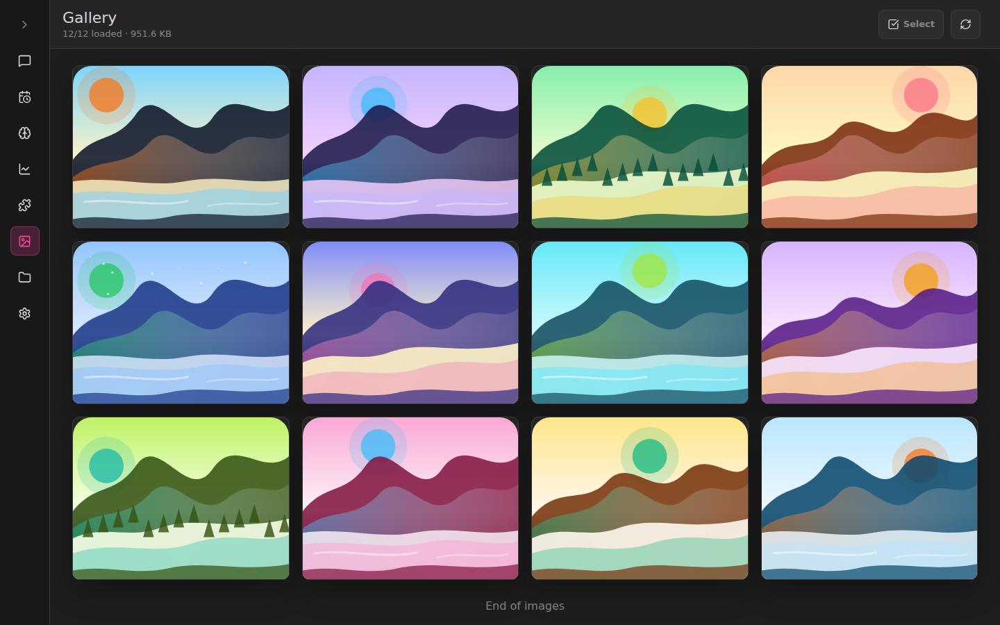
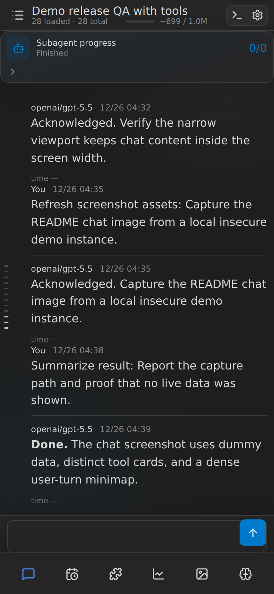
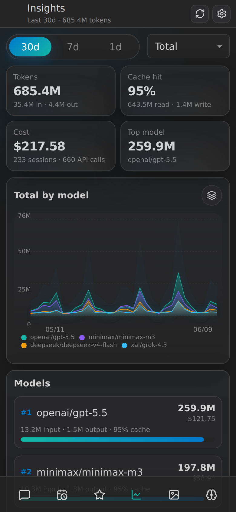

# Screenshots

Each row shows one README screenshot with a short description.

## Desktop

### Chat

Chat page in the light theme, showing a sanitized demo conversation and several tool cards.

### Insights

Insights dashboard in the light theme, showing 30-day usage, model totals, and a high cache-hit demo fixture.

### Skills

Skills manager in the light theme, showing a sanitized demo skill and its fixture files.

### Cron

Cron editor in the light theme, showing sanitized scheduled jobs and an editable job detail pane.

### Workspace

Workspace view in the dark theme, opened directly to a synthetic Rust source file with syntax highlighting.

### Gallery

Gallery in the dark theme, showing generated landscape placeholder thumbnails with sanitized metadata.

## Mobile

### Mobile chat

Mobile chat layout in the dark theme, showing the compact composer, bottom navigation, and demo tool cards.

### Mobile insights

Mobile Insights layout in the dark theme, showing the 30-day chart and cards within a narrow viewport.
